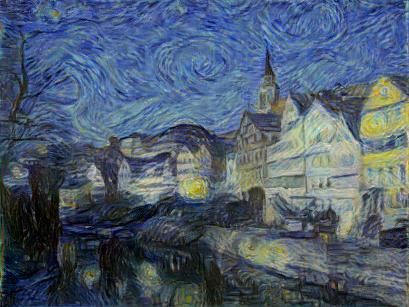
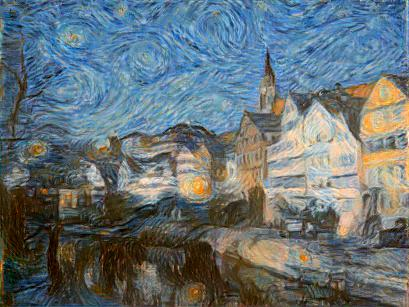

# Pytorch-Neural-Style-Transfer
A PyTorch implementation of neural style transfer with color control described in the papers:
* [A Neural Algorithm of Artistic Style](https://arxiv.org/pdf/1508.06576v2.pdf)
* [Controlling Perceptual Factors in Neural Style Transfer](https://arxiv.org/pdf/1611.07865.pdf)
## Examples
### The Neckarfront in Tübingen, Germany
The results were obtained with the default settings except `scale_img=0.7`.
*Tested on Ubuntu 18.04 and python 3.6.9*

<p align="center">


</p>

When you reduce the image size, the style becames coarser. Images from left to right: `original image`, `scale_img=1.0`, `scale_img=0.4`

<p align="center">


</p>

Also you can control color preservation. Set `preserve_colors` True to keep original content image colors. Example: `original image`, `preserve_colors=False`, `preserve_colors=True`

<p align="center">



</p>

## Requirements
- PyTorch >=1.7.0, torchvision >=0.7.0
- numply, matplotlib, pillow

You can install this with the command:
```
pip install -r requirements.txt
```

## Usage
```
python run.py --content <content_file> --style <style_file>
```
*Example* :
`python run.py --content images/tubingen.jpg --style images/starry-night.jpg`

#### Arguments
*Required* :
* `--content`: Path to content image.
* `--style`: Path to style image.

*Optional* :
* `--output`: Filename of the output image. *Default* : `result.jpg`
* `--iters`: The number of iterations to run. *Default* : `500`
* `--preserve_colors`: Save colors of the content image. *Default*: `False`
* `--scale_img`: Scaling factor of the image size. *Default* : `1.0`
* `--print_every`: The number of iterations to show info (set 0 to not show info). *Default* : `0`
* `--content_layers`: VGG19 layers used for content loss. *Default*: `r42`
* `--style_layers`: VGG19 layers used for style loss. *Default*: `r11 r21 r31 r41 r51`
* `--content_weights`: Content loss weights for each content layer. *Default*: `1.0`
* `--style_weights`: Style loss weights for each style layer. *Default*: `0.2 0.2 0.2 0.2 0.2`

#### Using in code
Single image prediction. `predict()` method takes a path to image, a pillow image or a numpy array and returns pillow image. You can use all the parameters above.
```python
from style_transfer import StyleTransfer
from PIL import Image
content = Image.open('images/tubingen.jpg')
style = Image.open('images/starry-night.jpg')
st = StyleTransfer()
img = st.predict(content, style, scale_img=0.5, print_every=100)
```
You can create a generator and set `yield_every` parameter as any number to get images during style transfer process.
```python
gen = st.predict_iterator(content, style, yield_every=50)
images = []
for image in gen:
	images.append(image)
```
Also there is a `predict_hr()` method, that applies style transfer two times to the same image, but in different scaling, which allows you to get an image with better quality. 

Parameters: 
- `hr_scale` - scaling factor of the image relative to original content image after first style transfer. *Default* : 1.0
- `hr_iters` - the number of iteration to run second style transfer. *Default* : 400

```python
img_hr = st.predict_hr(content,style,iters=300,scale_img=0.5,hr_scale=0.9)
```
See more in example.ipynb
